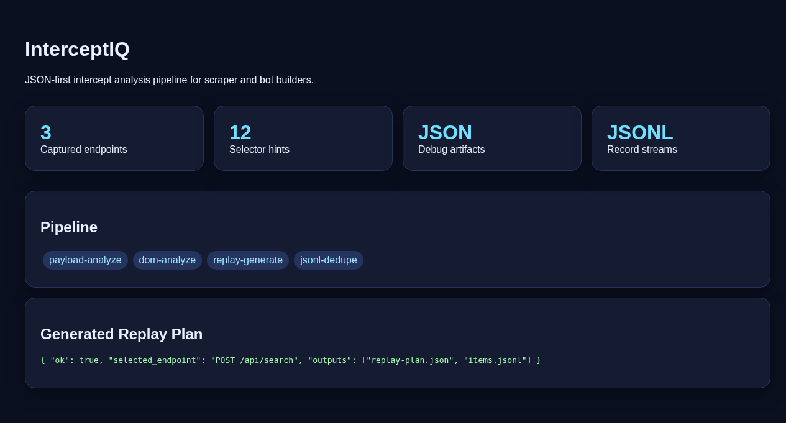

<div align="center">

# ⚡ InterceptIQ

**JSON-first web interception toolkit for AI coding agents**

[](https://github.com/guajiimi/interceptiq/actions/workflows/ci.yml)
[](https://pypi.org/project/interceptiq/)
[](https://www.python.org/downloads/)
[](LICENSE)
[](#contributing)
[](pyproject.toml)

Turn messy browser captures → structured JSON briefs, replay plans, and scraper scaffolds.

*Designed for [Codex](https://openai.com/index/codex/), [Claude Code](https://claude.ai), [Hermes Agent](https://github.com/nousresearch/hermes-agent), and any AI coding agent that needs structured context before building automation.*

</div>

---

## Why AI Agents Need This

AI coding agents are powerful but **context-limited**. They can't parse a 50MB HAR file or visually inspect browser DevTools. When you ask Codex to "build a scraper for this site," the agent needs structured, machine-readable context — not raw network dumps.

**InterceptIQ bridges this gap:**

- **Reduces context size** — From megabytes of raw capture to kilobytes of focused JSON
- **Provides actionable structure** — Endpoint cards, selector hints, and replay plans instead of raw data
- **Enables autonomous workflows** — Agents run InterceptIQ, read the JSON, and make implementation decisions without human intervention
- **Safe by construction** — Generated code never includes credentials, so agents can iterate unsupervised
- **Zero dependencies** — Pure Python stdlib; works instantly in any environment without `pip install` bloat

**Without InterceptIQ:** Paste a raw HAR dump into Codex → agent gets confused, wastes tokens, produces broken code.

**With InterceptIQ:** Run 5 CLI commands → agent receives clean JSON with endpoint cards, selector candidates, crypto flags, and a ready-to-use prompt → produces a working scraper on the first try.

## Architecture

```
┌─────────────────────────────────────────────────────────────────────┐
│                        INPUT: Browser Capture                       │
│         HAR file · Playwright trace · Proxy dump · Manual JSON      │
└──────────────────────────────┬──────────────────────────────────────┘
                               │
                               ▼
┌──────────────────────────────────────────────────────────────────────┐
│                       InterceptIQ CLI Engine                         │
│                                                                      │
│  ┌──────────────┐ ┌──────────────┐ ┌──────────────────────────────┐ │
│  │ payload-     │ │ dom-         │ │ replay-                      │ │
│  │ analyze      │ │ analyze      │ │ generate                     │ │
│  │              │ │              │ │                              │ │
│  │ • JSON decode│ │ • Forms      │ │ • replay-plan.json           │ │
│  │ • Form data  │ │ • Links      │ │ • replay_scraper.py          │ │
│  │ • Base64/hex │ │ • Inputs     │ │ • Safe header templates      │ │
│  │ • Gzip hints │ │ • Selectors  │ │ • urllib-only (no deps)      │ │
│  │ • Crypto flag│ │ • Images     │ │                              │ │
│  └──────┬───────┘ └──────┬───────┘ └──────────────┬───────────────┘ │
│         │                │                        │                  │
│         ▼                ▼                        ▼                  │
│  ┌──────────────────────────────────────────────────────────────────┐│
│  │                    agent-brief                                   ││
│  │  Combines all analysis into a single machine-readable brief      ││
│  │  with endpoint cards, workflow steps, and an agent prompt        ││
│  └──────────────────────────────┬───────────────────────────────────┘│
│                                 │                                    │
│  ┌──────────────────────────────┴───────────────────────────────────┐│
│  │                    jsonl-dedupe                                   ││
│  │  Key-based deduplication for JSONL data streams                  ││
│  └─────────────────────────────────────────────────────────────────┘│
└──────────────────────────────────────────────────────────────────────┘
                               │
                               ▼
┌─────────────────────────────────────────────────────────────────────┐
│                      OUTPUT: Structured JSON                         │
│   • payload-analysis.json  • dom-analysis.json  • agent-brief.json  │
│   • replay-plan.json       • replay_scraper.py  • items.jsonl       │
└─────────────────────────────────────────────────────────────────────┘
                               │
                               ▼
┌─────────────────────────────────────────────────────────────────────┐
│                    AI Agent (Codex / Claude Code / Hermes)           │
│   Reads structured JSON → Decides strategy → Writes working code     │
└─────────────────────────────────────────────────────────────────────┘
```

## Features

| Command | What it does |
|---------|-------------|
| `payload-analyze` | Decode JSON, form data, base64, gzip hints, hex values, crypto signatures from request/response payloads |
| `dom-analyze` | Extract links, forms, inputs, tables, iframes, selector hints from captured HTML |
| `replay-generate` | Generate `replay-plan.json` + starter Python scraper with safe header templates |
| `agent-brief` | Create an `agent-brief.json` with goals, endpoint cards, next steps, and a ready-to-use AI agent prompt |
| `jsonl-dedupe` | Key-based deduplication for JSONL record streams |

## Quick Start

```bash
# Install (zero dependencies — pure Python)
pip install interceptiq

# Or from source
git clone https://github.com/guajiimi/interceptiq.git
cd interceptiq && pip install -e .
```

### CLI Usage

```bash
# Analyze request/response payloads
interceptiq payload-analyze capture.json

# Extract DOM structure and selector hints
interceptiq dom-analyze capture.json

# Generate replay plan + starter scraper
interceptiq replay-generate capture.json --out-dir ./replay

# Create AI agent brief
interceptiq agent-brief capture.json -o agent-brief.json

# Deduplicate JSONL records
interceptiq jsonl-dedupe data.jsonl --key id --out clean.jsonl
```

### Python API

```python
from interceptiq.payload_analyze import analyze_intercept as payload_analyze
from interceptiq.dom_analyze import analyze_intercept as dom_analyze
from interceptiq.agent_report import build_agent_brief
import json

capture = json.loads(open("capture.json").read())

# Get structured payload analysis
payload_result = payload_analyze(capture)

# Get DOM selectors and structure
dom_result = dom_analyze(capture)

# Generate agent-ready brief
brief = build_agent_brief(capture)
```

## Real-World Output

Below is actual output from running InterceptIQ against the included example capture.

### `payload-analyze`

```
$ interceptiq payload-analyze examples/intercept.example.json

{
  "ok": true,
  "source": "interceptiq.payload_analyze",
  "target": "https://example.test",
  "summary": {
    "entries": 1,
    "endpoints_analyzed": 1,
    "crypto_labels": [
      "crypto-clue:signature",
      "crypto-clue:timestamp"
    ]
  },
  "findings": [
    {
      "method": "POST",
      "url": "https://example.test/api/search",
      "status": 200,
      "labels": [
        "crypto-clue:signature",
        "crypto-clue:timestamp",
        "json"
      ],
      "replayability": "needs-review"
    }
  ],
  "notes": [
    "Secrets are redacted; do not paste live credentials into reports."
  ]
}
```

### `dom-analyze`

```
$ interceptiq dom-analyze examples/intercept.example.json

{
  "ok": true,
  "source": "interceptiq.dom_analyze",
  "target": "https://example.test",
  "summary": {
    "frame_count": 0,
    "forms": 1,
    "links": 1,
    "images": 1
  },
  "main_document": {
    "tag_counts": {
      "html": 1, "body": 1, "form": 1,
      "input": 1, "button": 1, "a": 1, "img": 1
    },
    "forms": [{ "action": "/search", "method": "GET" }],
    "inputs": [{ "tag": "input", "name": "q", "type": "" }],
    "selector_hints": [
      { "selector": "[name=\"q\"]", "reason": "name" },
      { "selector": "[data-testid=\"search-button\"]", "reason": "data-testid" }
    ],
    "visible_text_sample": "Search Docs"
  },
  "selector_strategy": [
    "Prefer stable ids/data-testid/name/aria-label.",
    "Avoid generated hash classes when possible.",
    "Use repeated structures for list/card extraction."
  ]
}
```

### `replay-generate`

```
$ interceptiq replay-generate examples/intercept.example.json --out-dir ./replay

{
  "ok": true,
  "source": "interceptiq.replay_generate",
  "target": "https://example.test",
  "selected_endpoint": {
    "method": "POST",
    "url": "https://example.test/api/search"
  },
  "outputs": {
    "script": "./replay/replay_scraper.py",
    "items_jsonl": "./replay/items.jsonl"
  },
  "notes": [
    "Authorization/cookie headers are intentionally omitted.",
    "Use JSON for debug artifacts and JSONL for records."
  ]
}
```

### `agent-brief`

```
$ interceptiq agent-brief examples/intercept.example.json

{
  "ok": true,
  "source": "interceptiq.agent_report",
  "target": "https://example.test",
  "agent_workflow": {
    "goal": "Help an AI coding agent convert an intercept capture into a reliable scraper or bot implementation.",
    "recommended_steps": [
      "Run payload-analyze to classify request/response payload formats and signing clues.",
      "Run dom-analyze to identify selector candidates, forms, links, frames, and extraction targets.",
      "Run replay-generate for the most promising endpoint and review generated replay-plan.json.",
      "Use jsonl-dedupe for record streams and checkpoints.",
      "Iterate with an AI agent using the JSON outputs as machine-readable context."
    ],
    "agent_prompt": "You are given InterceptIQ JSON artifacts. Decide whether API replay, WebSocket replay, or DOM automation is the best strategy. Produce a safe scraper/bot plan using JSON for debug artifacts and JSONL for output records. Do not include secrets in code or logs."
  },
  "endpoint_cards": [
    {
      "method": "POST",
      "url": "https://example.test/api/search",
      "status": 200,
      "agent_task": "Classify whether this endpoint should be replayed directly or scraped through browser automation."
    }
  ],
  "outputs_expected": [
    "payload-analysis.json",
    "dom-analysis.json",
    "replay-plan.json",
    "replay_scraper.py",
    "items.jsonl"
  ]
}
```

### `jsonl-dedupe`

```
$ interceptiq jsonl-dedupe examples/items.raw.jsonl --key id --out clean.jsonl

{
  "ok": true,
  "input": "examples/items.raw.jsonl",
  "output": "clean.jsonl",
  "key": "id",
  "input_count": 3,
  "output_count": 2
}
```

## AI Agent Workflow

InterceptIQ is built for the **capture → analyze → build** loop:

1. **Capture** — Record traffic with Playwright, browser DevTools, or a HAR proxy
2. **Analyze** — Run `interceptiq payload-analyze` and `interceptiq dom-analyze`
3. **Brief** — Generate `agent-brief.json` with `interceptiq agent-brief`
4. **Build** — Paste the brief into Codex / Claude Code / Hermes Agent as structured context
5. **Iterate** — The agent writes a scraper; refine with `replay-generate` output

See [`docs/agent-workflow.md`](docs/agent-workflow.md) for the full guide, or [`docs/examples/real-world-demo.md`](docs/examples/real-world-demo.md) for a step-by-step walkthrough.

## Project Structure

```
interceptiq/
├── src/interceptiq/
│   ├── cli.py              # CLI entry point
│   ├── payload_analyze.py  # Request/response payload decoder
│   ├── dom_analyze.py      # HTML DOM structure extractor
│   ├── replay_generate.py  # Replay plan + scraper generator
│   ├── agent_report.py     # AI agent brief builder
│   ├── jsonl_pipeline.py   # JSONL dedup + append pipeline
│   └── __init__.py
├── examples/
│   ├── intercept.example.json
│   └── items.raw.jsonl
├── docs/
│   ├── agent-workflow.md
│   ├── examples/
│   │   └── real-world-demo.md
│   └── demo/index.html     # Visual dashboard demo
├── tests/
│   └── test_pipeline.py
├── pyproject.toml
└── LICENSE
```

## Demo Dashboard

Open [`docs/demo/index.html`](docs/demo/index.html) in a browser to see a visual summary of the analysis pipeline.



## Design Philosophy

- **Zero dependencies** — Pure Python 3.10+, no `pip install` bloat
- **JSON in, JSON out** — Every command reads JSON and writes JSON
- **Agent-first** — Output is structured for AI consumption, not human eyeballs
- **Privacy-aware** — Sensitive headers are redacted by default; no credentials in generated code
- **JSONL for streams** — Append-friendly, deduplication-ready data pipeline

## Contributing

PRs welcome! See the [issues](https://github.com/guajiimi/interceptiq/issues) for planned work.

```bash
# Development setup
git clone https://github.com/guajiimi/interceptiq.git
cd interceptiq
pip install -e ".[dev]"

# Run tests
pytest -v
```

## License

[MIT](LICENSE) — use it however you want.

---

<div align="center">

**Built for the AI agent era** ⚡

</div>
